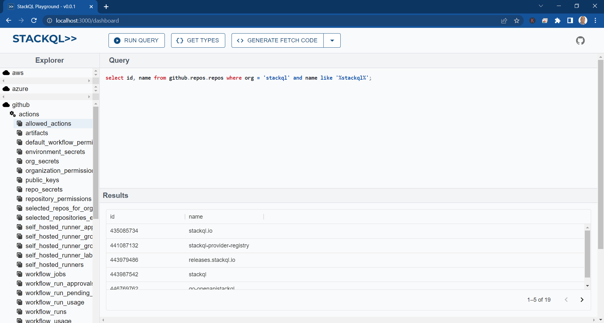
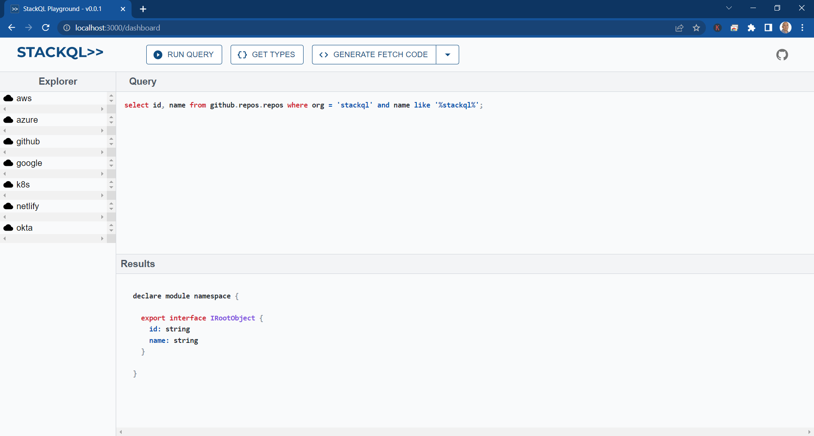
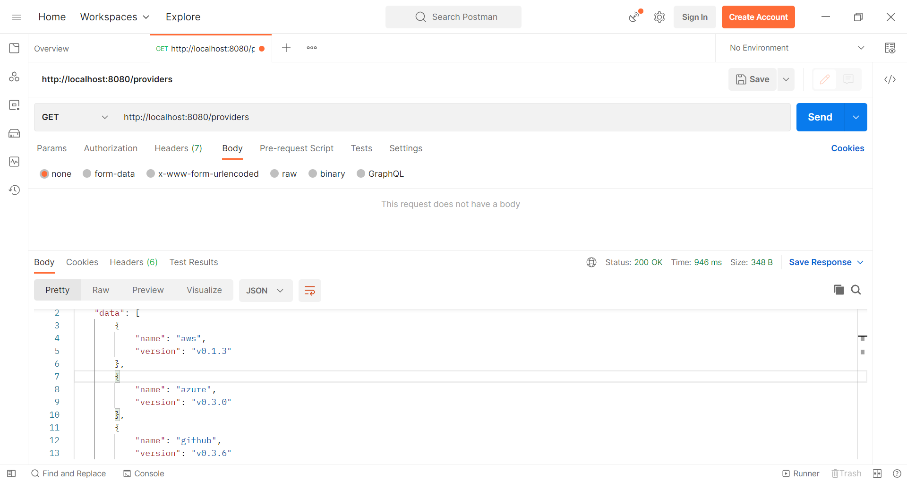
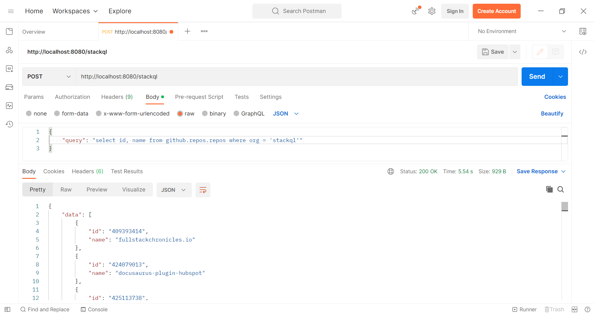

# StackQL Middleware Quickstart

Use the [docker-compose.yml](../docker-compose.yml) file included with this repository which contains a quick start to get up and running quickly.  This includes the following components:  

- [StackQL Server](https://github.com/stackql/stackql)
- [StackQL Playground](https://github.com/stackql/stackql-playground)
- [StackQL Middleware Server](../README.md)

## Providers

Using this quickstart example you can connect to and query any of the following StackQL public cloud/SaaS providers available from the [`stackql-provider-registry`](https://github.com/stackql/stackql-provider-registry):  

- [AWS](https://registry.stackql.io/providers/aws/)
- [Microsoft Azure](https://registry.stackql.io/providers/azure/)
- [Google Cloud Platform](https://registry.stackql.io/providers/google/)
- [Kubernetes](https://registry.stackql.io/providers/k8s/)
- [GitHub](https://registry.stackql.io/providers/github/)
- [Okta](https://registry.stackql.io/providers/okta/)
- [Netlify](https://registry.stackql.io/providers/netlify/)

## Steps

This quick start uses [docker compose v2](https://docs.docker.com/compose/).  

1. __Populate Environment Variables for Provider Authentication__

(Optional) Populate the following environment variables where required (for a provider for which you have credentials and want to query):  

- `STACKQL_GITHUB_USERNAME` and `STACKQL_GITHUB_PASSWORD` (GitHub Username and Personal Access Token)
- `AZURE_TENANT_ID`, `AZURE_CLIENT_ID`, `AZURE_CLIENT_SECRET` (for Azure access)
- `AWS_ACCESS_KEY_ID` and `AWS_SECRET_ACCESS_KEY` (AWS API credentials)
- `GOOGLE_CREDENTIALS` (Google service account)
- `DIGITALOCEAN_ACCESS_TOKEN`
- `LINODE_TOKEN`
- `DATABRICKS_ACCOUNT_ID`, `DATABRICKS_CLIENT_ID`, `DATABRICKS_CLIENT_SECRET` (for `databricks_account` or `databricks_workspace`)
- `CONFLUENT_CLOUD_API_KEY`, `CONFLUENT_CLOUD_API_SECRET` (for Confluent cloud access)
- `OKTA_API_TOKEN`
- `NETLIFY_AUTH_TOKEN`

> for additional provider support, export their authentication environment variables and add them to the `environment` section of the `runner` in [docker-compose.yml](../docker-compose.yml), for more information about authentication, check the documentation for the respective provider, see [here](https://registry.stackql.io/)

> ℹ️ To bring your own custom provider, add the provider dirctory to the `.stackql/src` directory on the runner image, then export a variable named `AUTH_STR` and pass this to the the stackql server as an argument in the `runner` section of the `docker-compose.yml` (`stackql --auth="${AUTH_STR}" --pgsrv.port=5444 srv`).  The `AUTH_STR` should map to the authentication method and variable names in your custom `provider.yaml` definition, e.g. `'{"my_provider": { "type": "api_key", "credentialsenvvar": "MY_KEY_VAR" }}'`.

2. __Start Environment__

Run the following command in the same environment you used in Step 1 to populate yor environment variables:  

```bash
docker compose up --build
```

3. __Use the Playground__

Use the Playground __Explorer__ pane to discover and describe available service and resources.  

Enter a StackQL query in the __Query__ pane, then..  

Use the __*Run Query*__ button to run the query and see the results in the __Results__ pane; and/or  

[](images/playground-query.png)

Use the __*Get Types*__ button to get the TypeScript types for the result set.  

[](images/playground-types.png)

Use the query and the types in your application.  

4. __Use the Middleware API__

The middleware API is accessible through port `8080`, you can use Postman, `curl`, or any other client library such as `node-fetch` or `axios` to run StackQL queries against this endpoint and return results as `application/json` responses.  

Meta routes such as:  

- `/providers`
- `/providers/{providerName}/services`
- `/providers/{providerName}/services/{serviceName}/resources`
- `/providers/{providerName}/services/{serviceName}/resources/{resourceName}`
- `/providers/{providerName}/services/{serviceName}/resources/{resourceName}/methods`

are accessible using `GET` requests as shown here:  

[](images/stackql-postman-meta-queries.png)

You can run a StackQL (`SELECT`) query against a `provider`, `service`, `resource` using a `POST` request as shown here:  

[](images/stackql-postman-queries.png)

5. __Stop the Environment__

Use `ctrl-c` to stop the environment.  

6. __Remove Containers__

Run the following command to remove the containers created in Step 2:  

```bash
docker compose down
```